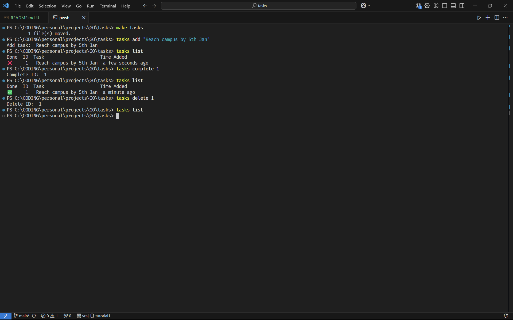

# Tasks CLI
Simple command line tool to add, complete and delete tasks.

## Usage
```bash
tasks <commands>
```
- commands = [**`add`** \<**_description_**> | [**`complete`** | **`delete`**] \<**_ID_**>]

## Installation
Run this command in terminal:
```bash
go build -o "tasks.exe" "./cmd"
```
## Demo


## Disclaimer
Use Makefile (`make tasks`) only if you are ready to have your **_tasks_** program in `C:/commands/` directory.